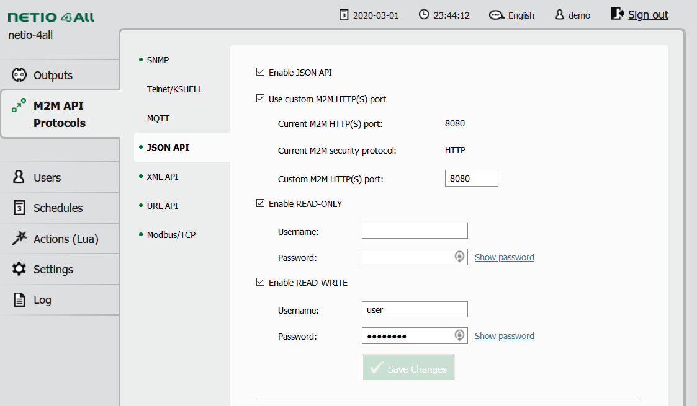

# Netio

python 3 Bindings and CLI for communication with NETIO Products devices

Install the latest package from pip
```bash
pip install Netio --upgrade
```
# API Interface

Login to your device and enable JSON API



Import Netio and create new instance with endpoint
```python
from Netio import Netio

n = Netio('http://netio-4ll.local:8080/netio.json', auth_rw=('admin', 'password'))
```

## HTTPS
When using HTTPS, you must provide correct certificate, or disable certificate verification altogether.

 1. Under `Settings->Network Configuration` enter correct hostname and domain. 
 2. Goto `Settings->Security Settings` and select *Generate new certificate*
 3. [Download](https://docs.digicert.com/manage-certificates/client-certificates-guide/manage-your-personal-id-certificate/windows-export-your-personal-id-certificate/) the certificate from your browser using browser

If you're accessing Netio wia IP address, set `verify=False` to disable certificate verification. 

Finally add `verify` parameter with path to downloaded certificate.
```pydocstring
n = Netio('http://netio-4ll.local:8080/netio.json', auth_rw=('admin', 'password'), verify='/path/to/cert.pem')
```


## Control
to set the output use either action, or integer value
```pydocstring
>>> n.set_output(1, 0)            # Set output 1 off
>>> n.set_output(1, n.ACTION.ON)  # Set output 1 on
```

To read the states of the outputs
```pydocstring
>>> for x in range(4):
>>>    print(n.get_output(x))
Output(ID=1, Name='out_1', State=1, Action=1, Delay=500, Current=0, PowerFactor=0.0, Load=0, Energy=13346833)
Output(ID=2, Name='out_2', State=0, Action=0, Delay=500, Current=0, PowerFactor=0.0, Load=0, Energy=2311032)
Output(ID=3, Name='out_3', State=1, Action=1, Delay=500, Current=8610, PowerFactor=1.0, Load=2062, Energy=11387035)
Output(ID=4, Name='out_4', State=1, Action=1, Delay=500, Current=11540, PowerFactor=1.0, Load=2768, Energy=21077736)
```

# CLI Interface
```
usage: cli.py [-h] [-u U] [-p P] [-C] [-c CFG] [-v] [--no-cert-warning] [--version] DEVICE COMMAND ...

positional arguments:
  DEVICE                Netio device URL
  COMMAND               device command
    get (GET, G, g)     GET output state
    set (SET, S, s)     SET output state
    info (INFO, I, i)   show device info

optional arguments:
  -h, --help            show this help message and exit
  -u U, --user U        M2M API username
  -p P, --password P    M2M API password
  -C, --cert            HTTPS Certificate
  -c CFG, --config CFG  Configuration file
  -v, --verbose         increase verbosity
  --no-cert-warning     Disable warnings about certificate's subjectAltName versus commonName
  --version             show program's version number and exit
```

 - `GET` takes another positional argument ID, by default print's all outputs
 - `SET` takes TWO arguments `ID` and `ACTION`. see `netio device SET --help`
 - `INFO` does not take any parameters

for more information about commands see `Netio device CMD --help`
 
You can also use configuration file, specified wia `--config netio.ini`. 
For explanation and example of the configration file see [examples](examples/netio.example.ini)

example usage:
```
# toggle output 1
Netio -u admin --password secret --cert mycert.pem netio.localhost SET 1 TOGGLE

# get information about device. credentials sourced from netio.ini
Netio --cert netio.ini netio.localhost INFO

# see information about output 1
Netio --cert netio.ini netio.localhost GET 1
```
